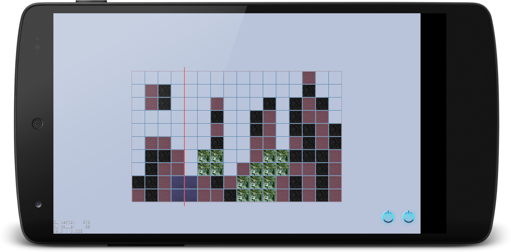

# Frenzy
iOS/Android Game inspired by Lumines developed in C++ with Cocos-2d-x



# Env setup

###1 - Install cocos2dx (3.17)
```
git clone git@github.com:cocos2d/cocos2d-x.git
cd cocos2d-x
git submodule update --init
git submodule update
./download-deps.py
./setup.py
source ~/.zshrc
```

###2 - Clone this repo

###3 - Compile and run

```
./run-<platform>.sh
```

